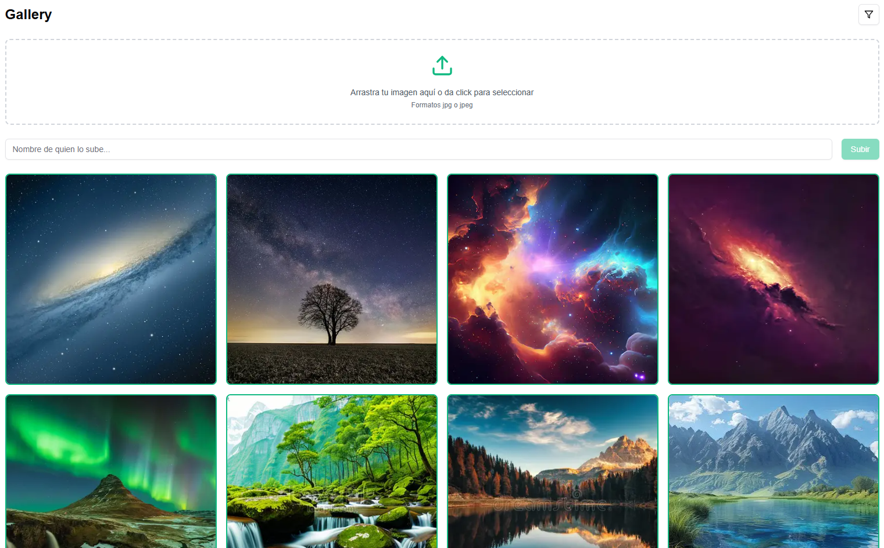
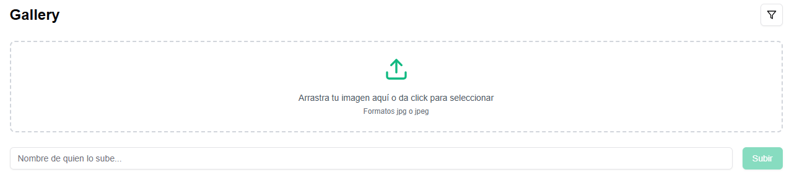
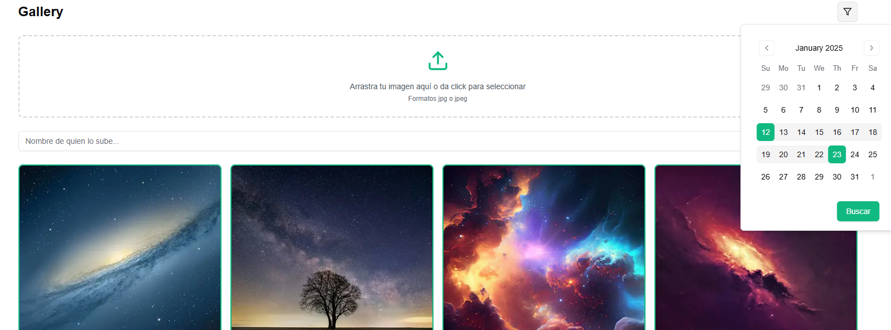
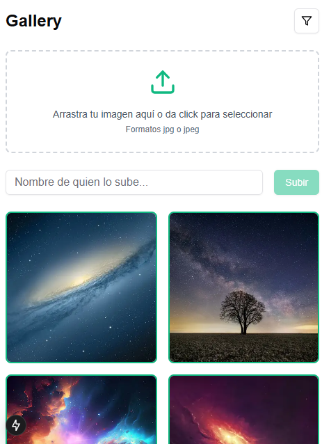

# Galería de Imágenes con Next.js 📸

Una aplicación web moderna construida con Next.js que permite a los usuarios subir, visualizar y filtrar imágenes por fecha. La aplicación proporciona una interfaz intuitiva para gestionar tu colección de imágenes con potentes capacidades de filtrado.

## 🚀 Características

- Subida de imágenes con soporte para arrastrar y soltar
- Vista de galería con diseño en mosaico
- Filtrado de imágenes por fecha
- Diseño responsivo para todos los dispositivos
- Vista previa de imágenes en tiempo real
- Carga perezosa para un rendimiento óptimo
- Capacidades avanzadas de búsqueda y filtrado

## 🖼️ Vista Previa

### Vista Principal de la Galería

*Vista principal de la galería mostrando el diseño en mosaico de las imágenes*

### Interfaz de Subida

*Interfaz de arrastrar y soltar para una fácil subida de imágenes*

### Sistema de Filtros

*Sistema de filtrado por fecha con integración de calendario*

### Vista Móvil

*Diseño responsivo optimizado para dispositivos móviles*

## 🛠️ Tecnologías Utilizadas

- Next.js 15
- React
- Tailwind CSS
- Shadcn-UI
- TypeScript
- Integración con API Backend Nestjs

## 🚀 Comenzando

### Requisitos Previos

- Node.js 18.0 o superior
- npm o yarn
- Git

### Instalación

1. Clona el repositorio:
```bash
git clone https://github.com/redmoart23/images-api-loggro-restobar-client.git
```

2. Navega al directorio del proyecto:
```bash
cd images-api-loggro-restobar-client
```

3. Instala las dependencias:
```bash
npm install
# o
yarn install
```

4. Crea un archivo `.env.local` en el directorio raíz y añade tus variables de entorno:
```env
NEXT_PUBLIC_API_URL=https://api.tudominio.com
```

### Ejecutar el Servidor de Desarrollo

```bash
npm run dev
# o
yarn dev
```

Abre [http://localhost:3000](http://localhost:3000) en tu navegador para ver la aplicación.

### Construir para Producción

```bash
npm run build
# o
yarn build
```

## 🔗 Integración con la API

La aplicación se conecta a una API backend para el almacenamiento y recuperación de imágenes. Los endpoints de la API son:

- `POST /api/images` - Subir nuevas imágenes
- `GET /api/images` - Obtener todas las imágenes
- `GET /api/images/search` - Obtener imágenes filtradas por fecha
- `DELETE /api/images/:id` - Eliminar una imagen

URL de ejemplo de la API: `https://api.imagegallery.com/v1`

## 📁 Estructura del Proyecto

```
├── src/
│   ├── app/
│   ├── components/
│   │   ├── Gallery/
│   │   ├── Upload/
│   │   └── Filter/
│   ├── pages/
│   ├── styles/
│   └── utils/
├── public/
├── .env.local
└── package.json
```

## 🤝 Cómo Contribuir

1. Haz un fork del repositorio
2. Crea tu rama de características (`git checkout -b feature/NuevaCaracteristica`)
3. Haz commit de tus cambios (`git commit -m 'Añadir alguna NuevaCaracteristica'`)
4. Haz push a la rama (`git push origin feature/NuevaCaracteristica`)
5. Abre un Pull Request

## 📄 Licencia

Este proyecto está licenciado bajo la Licencia MIT - ver el archivo [LICENSE.md](LICENSE.md) para más detalles.

## 📞 Soporte

Para soporte, envía un correo a redmoart@gmail.com o crea un issue en el repositorio.
